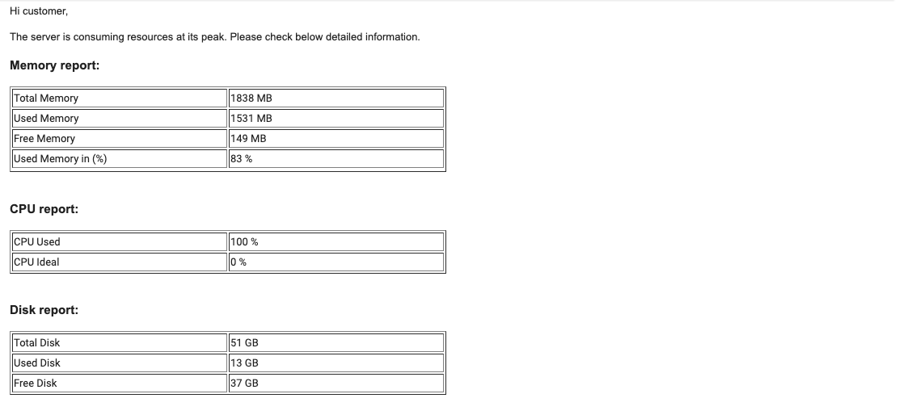
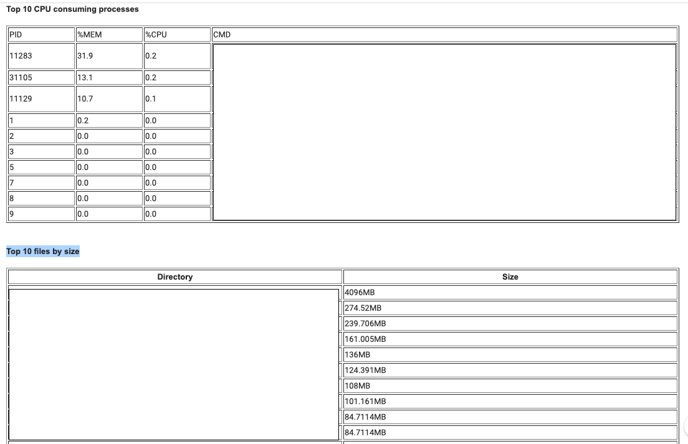

# Know thy server 

Hi Folks,

Have you faced a situation when servers and applications running on top of it are responding
very slow. As a first step, system admin should check the status of all system resources like 
RAM, CPU, Disk space or any port, etc.. and see if they are used properly. On Linux systems, 
provides us many tools like top, htop, vmstat, etc. to debug the issue.

Many times system admins need to send the report of this to a higher authority, at that time 
they need to manually extract all required values and generate the report.

The beginner level of admin could forget the commands, in that case, they need to find out 
this on the search engines.

It is a time consuming and repetitive task. Admins should think about how I can automate this? 

The solution is very easy; Gather all the required commands and create a shell script of this. 
So next time instead of going through manual steps just run the single script which will generate reports.

To start with, I have written a script which displays below information:

+ Physical Memory (RAM)

+ Disk Space

+ CPU Usage

+ Port monitoring.

The script is checked-in [here](https://github.com/Krishwaidande/Shell-Scripting/blob/master/server-monitoring.sh).

>> Command to run script : ./server-monitoring.sh

Note: There are monitoring tools as well available on the internet like Nagios, Zabbix, etc 

For learning purposes, it is good to create small scripts and use it to make daily tasks simple.

### Happy learning !!!!
