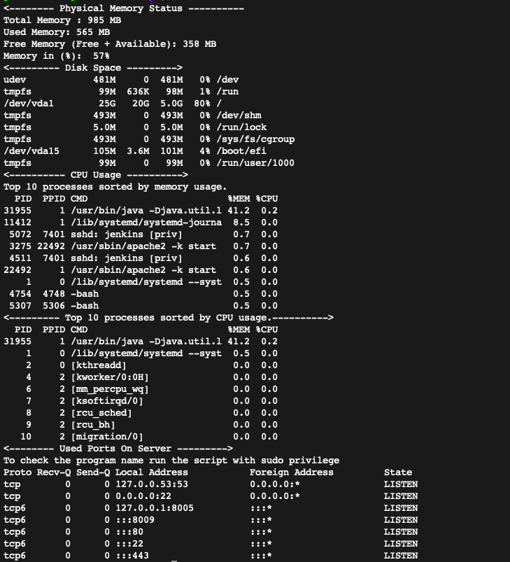

# Know thy server 

Hi Folks,

Have you faced a situation when the servers are responding very slow or applications running 
on it are not working properly? As a first step, every sys-admin should check the status of 
all system resources like RAM, CPU, Disk space or any port, etc.. and see if they are used 
properly. On Linux systems, there are so many command-line tools like top, htop, free to find 
out all information. 

Many times sys-admins are asked to send the report of this to a higher authority, that time 
admin will need to manually extract all required values and generate the report which is easily understood by other people.

The beginner level of sysadmins can forget the commands, in that case, they need to find out 
this on the search engines.

It is a time consuming and repetitive task. Admins should think about how I can automate this? 

The solution is very easy: Gather all the required commands and create a shell script of this. 
So next time instead of going through manual steps just run the single script which will generate reports.

To start with, I have written a script which displays below information:

+ Physical Memory Status (RAM)

+ Disk Space Status

+ CPU Usage Status

+ Used Ports On Server

The script is checked-in [here](https://github.com/Krishwaidande/Shell-Scripting/blob/master/server-statistics.sh).

>> Command to run script : ./server-statistics.sh

The output of the command:

Note: There are monitoring tools as well available on the internet like Nagios, Zabbix, etc 

For learning purposes, it is good to create small scripts and use it to make daily tasks simple.

### Future Enhancements:

- Sent this report on the email.

- Trigger the email when server resources are on its peak usage.

### Happy learning !!!!
